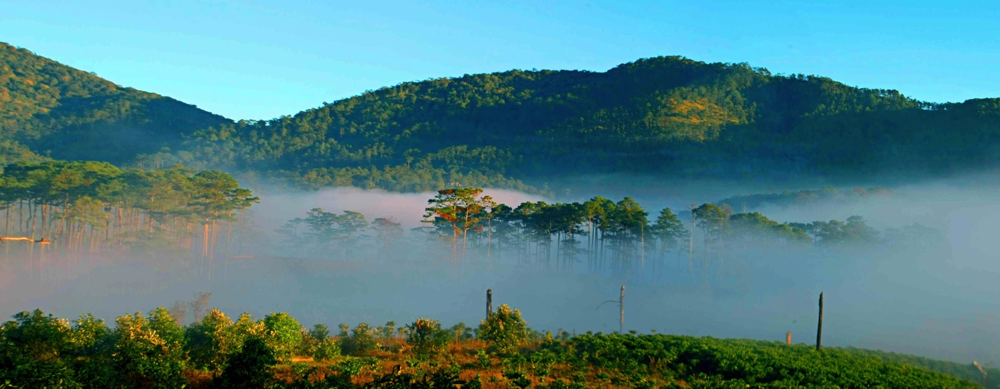
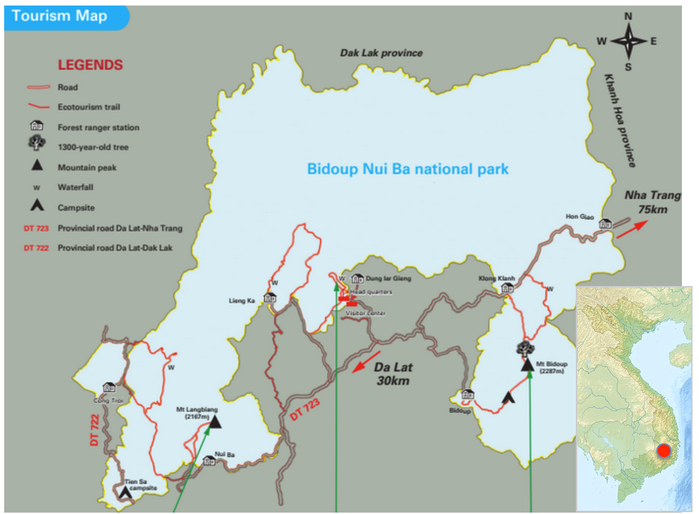
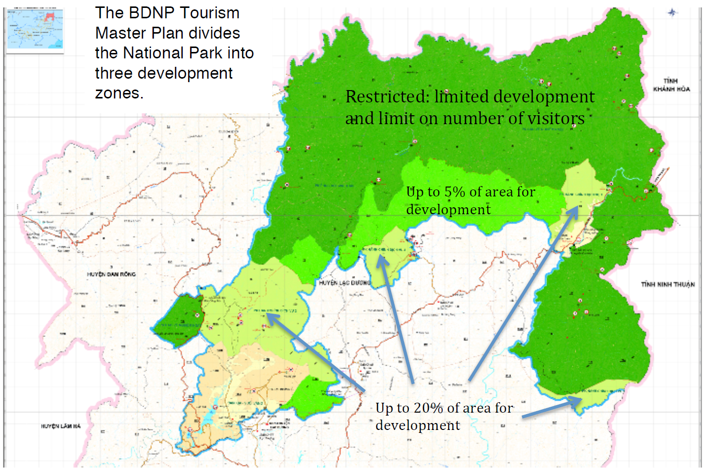
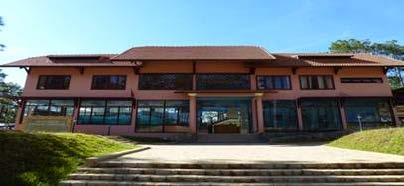
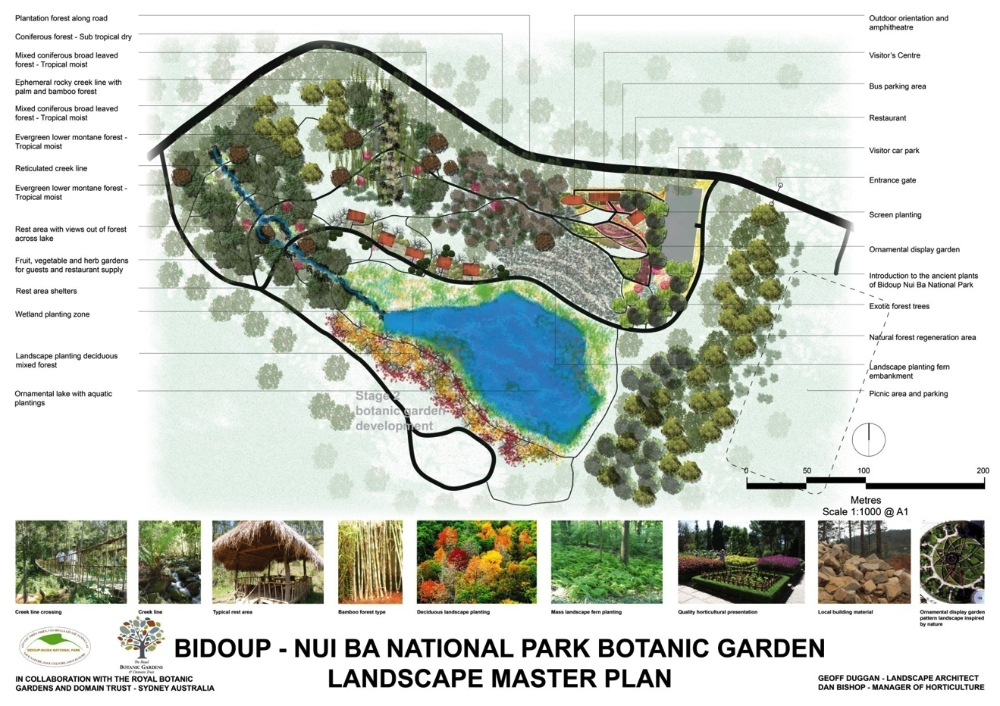
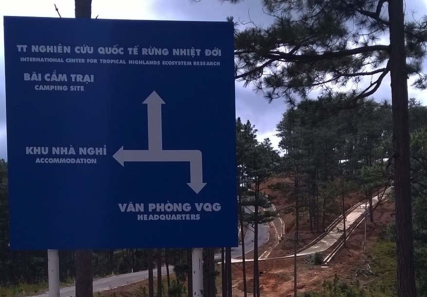
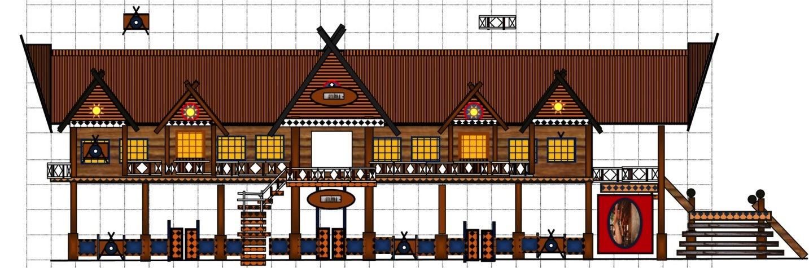

By  Dr. Giles Jackson, Shenandoah University

# Introduction

Located about 30 km from the historic city of Da Lat in the Central Highlands of Vietnam, Bidoup Nui Ba National Park (BDNP) is a place of outstanding natural beauty (Exhibit 1). Established in 2004, it is Vietnam’s fifth largest national park and is spread over 70,000 hectares (Exhibit 2).

Exhibit 1

Bidoup Nui Ba National Park. Photo: Nhat Tien

Exhibit 2

Source: bidoupnuiba.gov.vn and Wikipedia

BDNP is one of four natural biodiversity areas of Vietnam, 91% of which is covered by forests of different types. There are almost 2,000 recorded species of vascular plants, including 297 orchids, and a number of rare tree species, including Fokienia (up to 1300 years old). There are also 422 vertebrate species, including the endangered yellow-cheeked gibbon.

BDNP is part of the Langbiang Biosphere Reserved, recognized by UNESCO.

The region is home to the indigenous K’Ho people, comprising four ethnic groups.

Unprecedented social and economic development of the Greater Mekong, coupled with tight linkages between ecosystem and human development in the region makes conservation work urgent, significant and hugely challenging (World Wildlife Fund).

# Vision

In 2014 BDNP launched its Master Plan for Tourism Development, with a vision to “become a world class national park as the basis for developing the tourism industry in general and eco-tourism in particular of Lam Dong province.” The plan is aligned with the national and provincial tourism master plans and the 2010 Convention on Biological Diversity. Multiple stakeholders were involved in its development, including the K’Ho people. The BDNP plan divides the park into 3 zones (Exhibit 3) to control tourism development. There are various ideas for attractions, including an extended network of trails (multi-day hikes with camping), a zoo, zip-line, tree house, waterfall feature, etc. Community-based ecotourism is a top priority.

Exhibit 3

Source: BDNP Master Plan

# Destination Hub

Exhibit 4 shows the Environmental Education and Ecotourism Center, funded by JICA (a Japanese development agency). The center serves as the gateway to the Destination Hub (Exhibit 5). There’s a small lake, villas for rent, a communal dining area/meeting space, and a planned botanical garden. The national park’s headquarters is located nearby, along with a fully operational tissue culture lab (funded by Columbia University) that nurtures endemic species, including cancer-fighting orchids. Plans have also been drawn up for an eco-cultural K’Ho museum (Exhibit 6). The headquarters for the International Centre for Tropical Highland Ecosystems Research (ICTHER) is located in the hub. A state-of-the-art biodiversity science lab is also planned and will be located a few kilometers from the main site.

Exhibit 4  

Source: bidouptour.com

Exhibit 5  

Source: Bidoup Nui Ba National Park

*This page is an excerpt from an article written by Dr. Giles Jackson, Shenandoah University. View the original article [here](assets/2015-SciEcoProgBDNP-Giles.pdf).*

Exhibit 6

Source: Technical report of the project “The First NTFP Eco-Cultural Museum in Vietnam”, Feb 2014

**More information**

[Official Website](http://bidoupnuiba.gov.vn/)

[Wikipedia](https://en.wikipedia.org/wiki/Bidoup_N%C3%BAi_B%C3%A0_National_Park)

[ForestGEO](https://forestgeo.si.edu/sites/vietnam/bidoup)
