# People

Many friends were made.

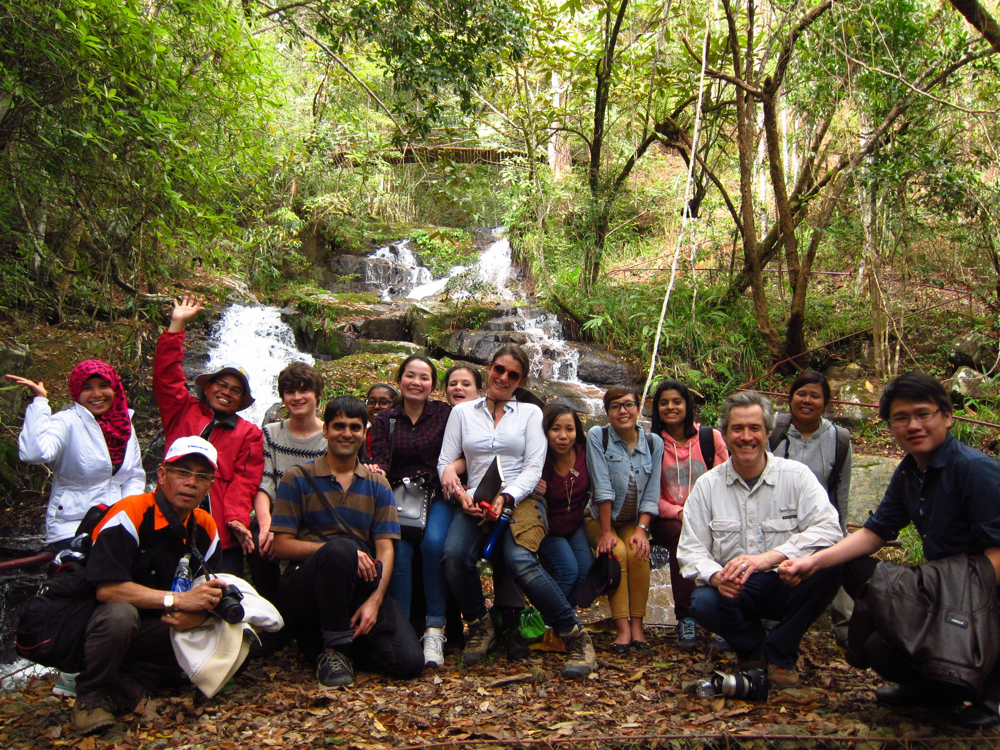

An international group --- Vietnam, Singapore, US, India, Myanmar, Indonesia, UK, Australia, Thailand, and the Philippines.

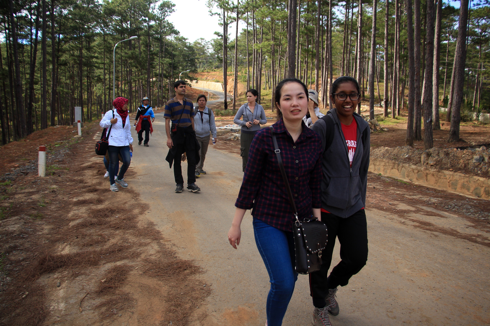

# Field work

Rainwater collection for isotope analysis  

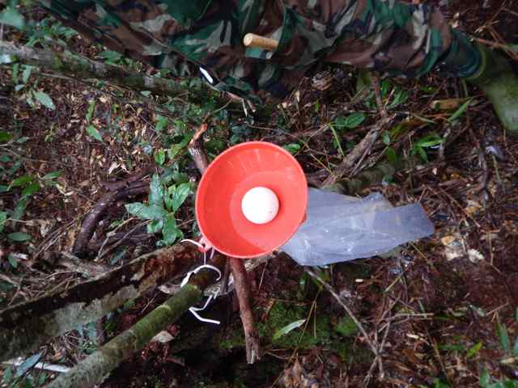

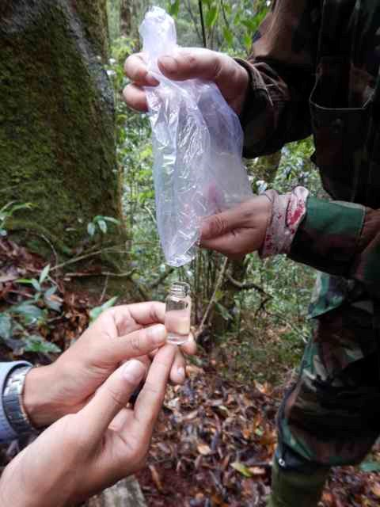

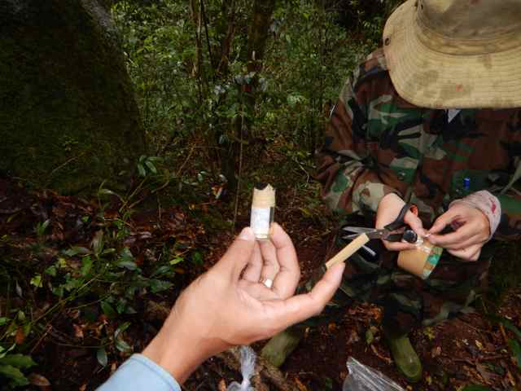

Collecting core sample

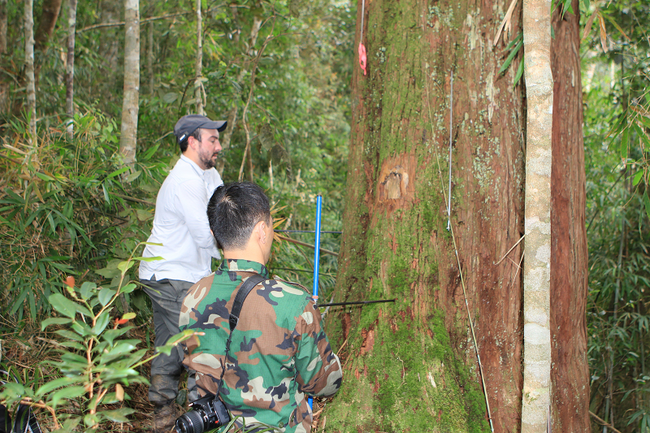

Collecting full sunlight leaves for gas exchange measurement

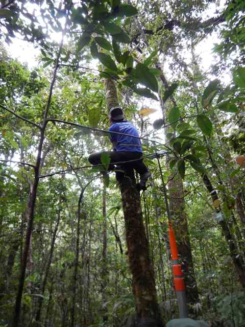

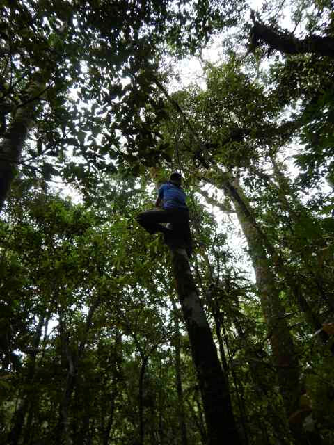

Taking micro-cores to quantify timing of cambial cell division

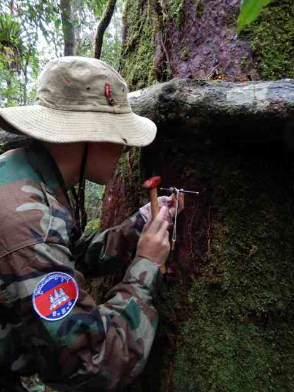

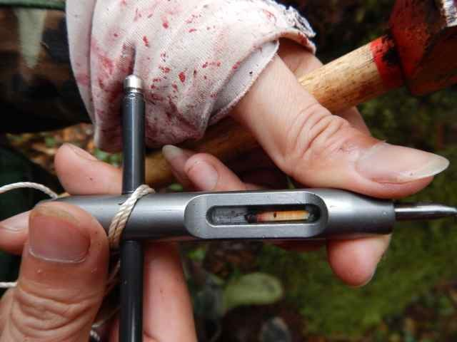

Mounting cores

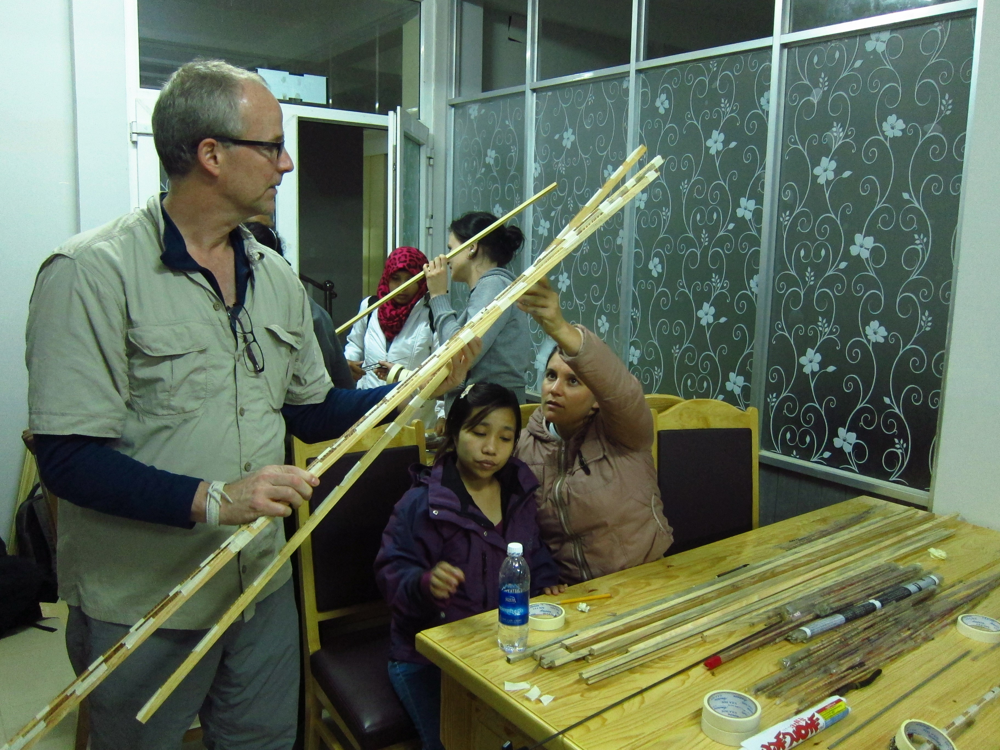