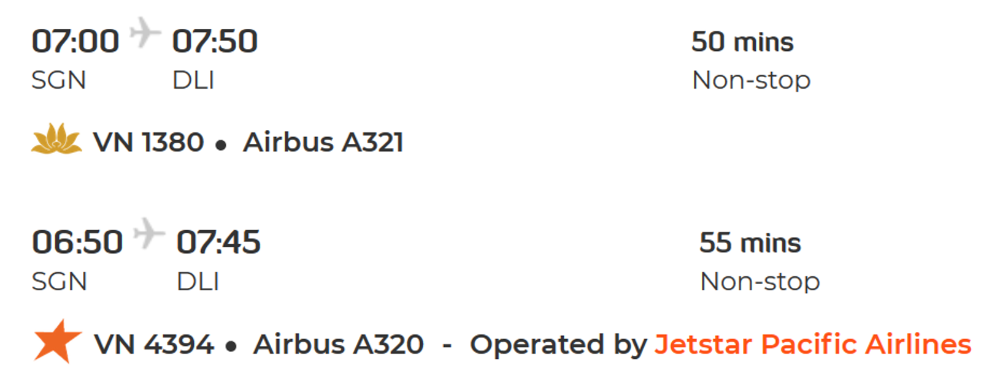

# Introduction

SAPEC-2020 is the first official gathering of the Southeast Asian Paleo Environments Consortium, as well as a workshop open to all aspiring early career scientists in paleoclimate fields. Along with two full days of fieldwork in our established Bidoup Nui Ba National Park (BDNP) study sites, [Dr. Brendan Buckley](https://eesc.columbia.edu/faculty/brendan-buckley) (Columbia University) will lead three days of intensive methodology instruction and discussion, ranging from generating data to producing complex models for climate reconstruction, and all the steps in between. For this purpose, we will use samples and data already generated from our published studies in the region, which are the result of a long history of NSF funding.

**Time**  
Pre-workshop: January 4-5, 2020  
Main workshop: January 6-12, 2020
 
**Location**  
International Center for Tropical Highlands Ecosystems Research (ICTHER)  
Bidoup Nui Ba National Park (BDNP), Lam Dong Province, Vietnam

[Register](https://forms.gle/NypjEr3EHKph5FCP8)
# Participants

Below are SAPEC members who have confirmed attendance.

## Dendrochronology
Brendan M. Buckley, Columbia University, US (Dendro)  
Edward R. Cook, Columbia University, US (Dendro/Methods)  
Justin T. Maxwell, Indiana University, US (Dendro/Ecology)  
Grant Harley, University of Idaho, US (Dendro/Speleo)  
Paolo Cherubini, WSL, CH (Dendro/Anatomy)  
Holger Gaertner, WSL, CH (Dendro/Anatomy)  
Sylvia Passardi, WSL, CH (Dendro/Anatomy)  
Chenxi Xu, Chinese Academy of Science, CN (Dendro/Isotopes)  
Fan Zexin, Xishuangbanna Tropical Botanical Garden, CN (Dendro/Ecology)

## Sediments, Corals and Other Proxies
Lora Stevens, California State University, Long Beach, US (Seds/Isotopes)  
Yvette Eley, University of Birmingham, UK (Seds/leaf waxes)  
Xin Zhou, University of Science & Technology of China, CN (Seds/Isotopes)  
Nathalie Goodkin, Nanyang Technological University, SG (Coral/Isotopes)  
Bridget Warren, University of Birmingham, UK (Seds/leaf waxes)  
Toby Everard, University of Birmingham, UK (Seds/leaf waxes)  

## Climate Dynamics/Hydrology
Shih-Yu Simon Wang, Utah State University, US (Climate Dynamics/Modeling)  
Stefano Galelli, Singapore University of Technology and Design, SG (Hydrology/Methods)  
Hung T.T. Nguyen, Singapore University of Technology and Design, SG (Hydrology/Methods)  

## Other Disciplines
Truong Luu Hong, Southern Institute of Technology, VN (Ecology/Botany)  
Brian Zotolli, VN (Southeast Asian Historian)  
Gretchen Coffman, University of San Francisco, US (Restoration Ecology)  

# Program

## Pre-workshop (January 4--5)

Pre-workshop activities include preparing samples and informal discussions.

## Main program (January 6--12)

* Day 1: Orientation & Introduction
* Days 2 and 3: Sampling
* Days 4: Sample processing classes
* Days 5 and 6: Data analysis & climate reconstruction classes
* Day 7: Group presentation & closing

Besides instructional presentations, participants will be given ample opportunities to practice the skills hands-on. They will apply the newly learned skills directly to a group project, which will be presented on the last day.

During most evenings, participants will share their own research in conference-style (12 minutes for presentation and 3 minutes Q&A).

### Program details

<table class="tg">
  <tr>
    <th class="tg-eb5z">Time</th>
    <th class="tg-eb5z">Activity</th>
  </tr>
  <tr>
    <td class="tg-v0hj" colspan="2">Monday, Jan 6 — Orientation &amp; Introduction to proxies</td>
  </tr>
  <tr>
    <td class="tg-0pky" rowspan="2">Morning</td>
    <td class="tg-0pky">Arrival, check-in, ice-breaking</td>
  </tr>
  <tr>
    <td class="tg-0pky">Welcome &amp; introduction</td>
  </tr>
  <tr>
    <td class="tg-0pky" rowspan="2">Afternoon &amp; evening</td>
    <td class="tg-0pky">Introduction to proxies: ring-width, blue-intensity, δ18O, leaf wax, lake sediments, wood anatomy</td>
  </tr>
  <tr>
    <td class="tg-0pky">Group formation</td>
  </tr>
  <tr>
    <td class="tg-v0hj" colspan="2">Tuesday, Jan 7 — Field day 1 at Giang Ly plot</td>
  </tr>
  <tr>
    <td class="tg-0pky" rowspan="2">Morning &amp; afternoon</td>
    <td class="tg-0pky">
      <b>Field demonstration</b>
      <ul>
        <li>Dendroecological sampling </li>
        <li>Leaf wax sampling</li>
        <li>ODK field data collection</li>
      </ul>
    </td>
  </tr>  
  <tr>
    <td class="tg-0pky">Sample collection</td>
  </tr>
  <tr>
    <td class="tg-0pky" rowspan="2">Evening</td>
    <td class="tg-0pky">Participants’ short talks</td>
  </tr>
  <tr>
    <td class="tg-0pky">Group project work</td>
  </tr>
  <tr>
    <td class="tg-v0hj" colspan="2">Wednesday, Jan 8 — Field day 2 at Hon Giao Dwarf Forest &amp; Giang Ly plot</td>
  </tr>
  <tr>
    <td class="tg-0pky" rowspan="2">Morning</td>
    <td class="tg-0pky">Sample collection at Hon Giao Dwarf Forest</td>
  </tr>
  <tr>
    <td class="tg-0pky">Lunch at Hon Giao Station with rangers</td>
  </tr>
  <tr>
    <td class="tg-0pky">Afternoon</td>
    <td class="tg-0pky">Sample collection at Giang Ly Plot</td>
  </tr>
  <tr>
    <td class="tg-0pky" rowspan="3">Evening</td>
    <td class="tg-0pky">Participants’ short talks</td>
  </tr>
  <tr>
    <td class="tg-0pky">Group project work</td>
  </tr>
  <tr>
    <td class="tg-0pky">Data analysis and visualization with R (optional)</td>
  </tr>
  <tr>
    <td class="tg-v0hj" colspan="2">Thursday, Jan 9 — Methods day 1: Chronology Development</td>
  </tr>
  <tr>
    <td class="tg-0pky" rowspan="2">Morning</td>
    <td class="tg-0pky">
      <b>Measurement</b>
      <ul>
        <li>Demonstration andUpdate  hands-on practice with CooRecorder: ring width &amp; BI</li>
        <li>Wood anatomy analysis</li>
        <li>Data management with ODK</li>
      </ul>
    </td>
  </tr>
  <tr>
    <td class="tg-0pky">Hands-on practice + project work</td>
  </tr>
  <tr>
    <td class="tg-0pky" rowspan="2">Afternoon</td>
    <td class="tg-0pky">
      <b>Chronology Building</b>
      <ul>
        <li>Cross-dating</li>      
        <li>Detrending and standardization</li>
        <li>Demonstration: ARSTAN, COFECHA, and dplR</li>
      </ul>
    </td>
  </tr>  
  <tr>
    <td class="tg-0pky">Hands-on practice + project work</td>
  </tr>
  <tr>
    <td class="tg-0pky" rowspan="2">Evening</td>
    <td class="tg-0pky">Participants’ short talks</td>
  </tr>
  <tr>
    <td class="tg-0pky">Group project work</td>
  </tr>
  <tr>
    <td class="tg-v0hj" colspan="2">Friday, Jan 10 — Methods day 2: Chronology and climate</td>
  </tr>
  <tr>
    <td class="tg-0pky" rowspan="2">Morning</td>
    <td class="tg-0pky">
      <b>Climate-proxy relationship</b>
      <ul>
        <li>Correlation analysis</li>
        <li>Bootstrapping, confidence interval, statistical significance</li>
      </ul>
    </td>
  </tr>
  <tr>
    <td class="tg-0pky">Hands-on practice + project work</td>
  </tr>
  <tr>
    <td class="tg-0pky" rowspan="2">Afternoon</td>
    <td class="tg-0pky">
      <b>Extracting information from proxies</b>
      <ul>
        <li>Principal component analysis</li>
        <li>Input variable selection</li>
      </ul>
    </td>
  </tr>  
  <tr>
    <td class="tg-0pky">Hands-on practice + project work</td>
  </tr>
  <tr>
    <td class="tg-0pky" rowspan="2">Evening</td>
    <td class="tg-0pky">Participants’ short talks</td>
  </tr>
  <tr>
    <td class="tg-0pky">Hands-on practice + project work</td>
  </tr>
  <tr>
    <td class="tg-v0hj" colspan="2">Saturday, Jan 11 — Methods day 3: Reconstruction</td>
  </tr>
  <tr>
    <td class="tg-0pky" rowspan="2">Morning</td>
    <td class="tg-0pky">
      <b>Climate reconstruction</b>
      <ul>
        <li>Point-by-point regression</li>
        <li>Linear dynamical systems</li>
      </ul>
    </td>
  </tr>  
  <tr>
    <td class="tg-0pky">Hands-on practice + project work</td>
  </tr>
  <tr>
    <td class="tg-0pky" rowspan="3">Afternoon</td>
    <td class="tg-0pky">Cross validation</td>
  </tr>
  <tr>
    <td class="tg-0pky">Post-processing, time series analysis, and visualization</td>
  </tr>
  <tr>
    <td class="tg-0pky">Hands-on practice and project work</td>
  </tr>
  <tr>
    <td class="tg-0pky" rowspan="2">Evening</td>
    <td class="tg-fymr">Traditional ethnic dance and music of K’Ho people</td>
  </tr>
  <tr>
    <td class="tg-fymr">Fireside games</td>
  </tr>
  <tr>
    <td class="tg-v0hj" colspan="2">Sunday, Jan 12 — Presentation &amp; closing</td>
  </tr>
  <tr>
    <td class="tg-0pky">Morning</td>
    <td class="tg-fymr">Group presentations</td>
  </tr>
  <tr>
    <td class="tg-0pky">Afternoon</td>
    <td class="tg-0pky">Lunch, closing, return to Da Lat</td>
  </tr>
</table>

# Cost

* Main workshop: USD 550 per participant. The cost covers food, accommodation, conference room, sampling and measurement equipment, rangers, and transportatin.
* Pre-workshop: additional USD 250 per participant.

Payment will be by telegraphic transfer to BDNP's account. BDNP will bear the transfer fee. After registering, you will receive an email with payment details.

# Logistics

## Arrival in Da Lat

Participants can choose one of two options:
*	Group 1: arrive in Da Lat on Monday Jan 6 on one of these two flights 
*	Group 2: arrive in Da Lat on Sunday Jan 5 (or before) and stay there at your own cost. To ease logistics, we request that you stay at the same hotel, which we will recommend later.

Our bus to BDNP will pick up group 1 from Da Lat Airport at 8:30, then will pick up group 2 at the hotel at about 9:00.

During [registration](https://forms.gle/NypjEr3EHKph5FCP8), you will be asked for your preferred option.

## Departure from Da Lat

On Jan 12, bus will leave BDNP at 1 PM for Da Lat. You should have enough time to take the evening flights back to Ho Chi Minh. Or you can stay longer and explore Da Lat.

## Contacts

Brendan M. Buckley (scientific program)  
bmb@ldeo.columbia.edu  
Hung T.T Nguyen (logistics & outreach)    
tanthaihung_nguyen@mymail.sutd.edu.sg
